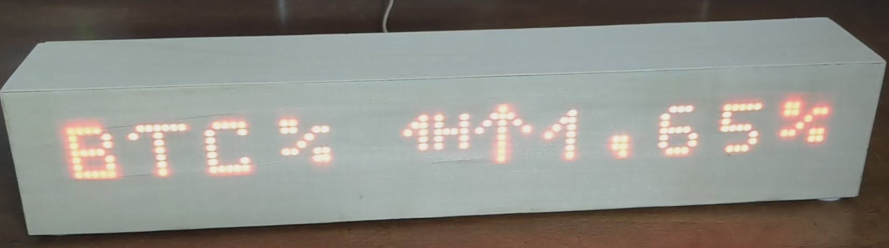

# ESP32 Cryptocoin Ticker
## An ESP32 based Cypto-Coin-Ticker with a local webserver for configuration.
### The coins are diplayed using a Max7219 led matrix display. 
### [See the coin ticker in action (Youtube)](https://www.youtube.com/watch?v=w_j1PZ59WdM&ab_channel=JPLittle)

# Build
## Hardware
1. By default 12 pics Max7219 matrix led displays are connected in series. 
[Configure your amount of segment](https://github.com/jaklPhil/ESP32-CoinTicker/blob/142fd289484f6ea025aad8ce77ce2ab9006e19a5/src/displayService/matrixDisplay.h#L4)
2. Connect the matrix display to the ESP:

| ESP32 pin   | Max7219 pin |
| ----------- |-------------|
| GPIO18      | CLK         |
| GPIO15      | CS          |
| GPIO23      | DIN         |
| GND         | GND         |
| 3.3V        | VCC         |

## Software
1. Install [PlatformIO](https://platformio.org/platformio-ide) extension.
2. Configure your Wifi [setupWifi.h](src/espService/setupWifi.h).
3. Connect your ESP32 an run PlatformIO "upload". 

# Running and configuration
Use an device connected to the same local network and navigate to the ip-adress, which is displayed on startup. 
On the webpage you can configure the displayed coins and brightness of the display. 

